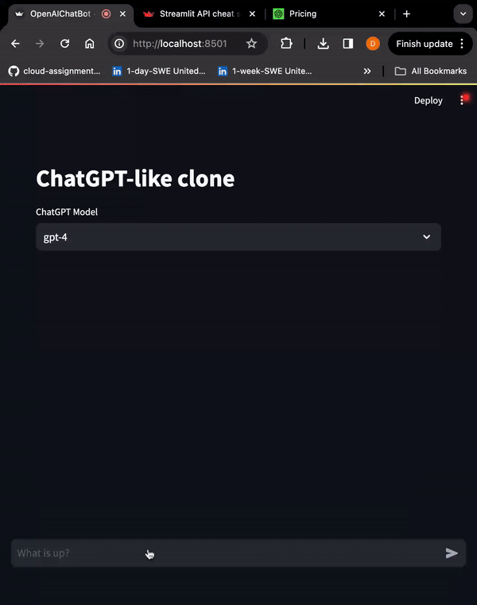

# Streamlit Chatbot Examples

## Introduction

This repository contains a collection of simple chatbot examples built using Streamlit. Streamlit is an open-source app framework specifically designed for Machine Learning and Data Science projects. These examples are designed to demonstrate the capabilities of Streamlit in creating interactive chatbot applications.

## Getting Started

To get started with these examples, you need to have Python installed on your system. If you don't have Python installed, you can download it from [python.org](https://www.python.org/).

### Installation

1. Clone this repository to your local machine using:

   ```
   git clone git@github.com:parthasarathydNU/AI-Learning.git
   ```

2. Navigate to the cloned directory:

   ```
   cd ./AI-Learning/AIResearch/streamlit
   ```

3. Set Up Virtual Environment 

4. Install the required packages:

   ```
   pip install -r requirements.txt
   ```

### Running the Examples

To run a Streamlit app, navigate to the app's directory and use the `streamlit run` command followed by the script name. For example:

```
streamlit run ChatBotWithStreaming.py
```

## Examples Overview

- **[Basic Chatbot](./ChatBotWithStreaming.py)**: This example demonstrates a simple chatbot that responds to user inputs with predefined answers.
- **[AI-based Chatbot](./OpenAIChatBot.py)**: An advanced example showcasing an AI-powered chatbot capable of more dynamic interactions. 


## How to Use

- Launch the app of your choice as mentioned in the "Running the Examples" section.
- Interact with the chatbot through the provided interface.
- Explore the code to understand how Streamlit facilitates chatbot development.

## Contributing

We welcome contributions to this repository! If you have suggestions or improvements, please fork the repo and submit a pull request.

## License

This project is licensed under the [MIT License](LICENSE.md).

## Acknowledgments

- Streamlit Documentation: [https://docs.streamlit.io/](https://docs.streamlit.io/)
